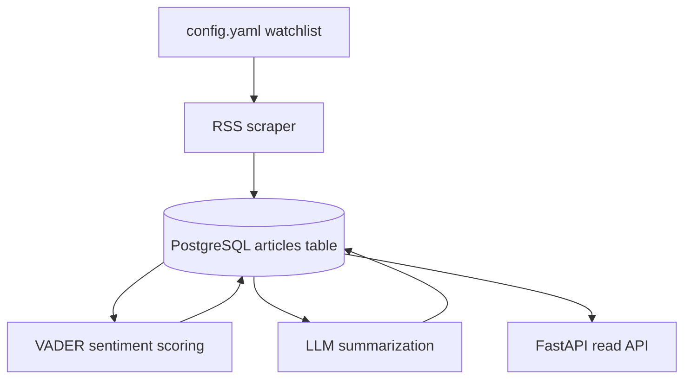

# Stock Intelligence Backend

Backend service for ingesting finance news, storing articles in Postgres, scoring sentiment, generating LLM summaries, and exposing stock-focused API endpoints.

## Overview

This service pulls RSS headlines for a configurable watchlist, stores normalized articles in PostgreSQL, enriches them with sentiment and LLM-generated insights, and serves aggregated stock views through a FastAPI application.

### What it does

- Fetches stock news from Yahoo Finance RSS feeds.
- Persists articles in PostgreSQL with duplicate protection on URL.
- Adds sentiment scores and labels using VADER.
- Generates article bullets and keywords through an OpenAI-compatible LLM endpoint.
- Exposes API endpoints for hot stocks and stock detail views.

### Data flow



## Resources

- Functional spec: add link here
- Design: add link here
- Jira board: add link here

## Architecture

- Language: Python 3.13
- API framework: FastAPI
- Database: PostgreSQL 16
- HTTP server: Uvicorn
- News ingestion: feedparser + BeautifulSoup
- Sentiment analysis: VADER Sentiment
- LLM integration: OpenAI-compatible API via `openai`

### Repository layout

- `api_server.py`: FastAPI app entry point.
- `main.py`: batch pipeline that runs scraping, sentiment scoring, and LLM enrichment.
- `backend/api/routes.py`: HTTP routes for stock data.
- `db/`: database connection and persistence helpers.
- `scraper/`: RSS fetching and HTML cleanup.
- `nlp/`: sentiment and LLM processing.
- `config.yaml`: scraper watchlist and RSS template.

## Local Development

### Prerequisites

- Python 3.13
- `uv`
- Docker and Docker Compose

### 1. Environment Setup

Create a `.env` file in the project root with these values:

```env
ENVIRONMENT=local
DATABASE_URL=postgresql://<user>:<password>@<host>/<database>?sslmode=require
LLM_BASE_URL=https://your-llm-provider.example/v1
LLM_API_KEY=your-api-key
LLM_MODEL=your-model-name
```

If you want to keep using a local PostgreSQL instance, you can continue setting `DB_HOST`, `DB_PORT`, `DB_NAME`, `DB_USER`, and `DB_PASSWORD` instead of `DATABASE_URL`.

The scraper watchlist and RSS template live in `config.yaml`.

### 2. Start PostgreSQL

For local development, the database can run in Docker:

```bash
docker compose up -d db
```

This starts PostgreSQL on the port defined in `docker-compose.yaml`. Skip this step if you are using Neon.

### 3. Install Dependencies

```bash
uv sync
```

### 4. Run the API

```bash
uv run uvicorn api_server:app --reload --host 0.0.0.0 --port 8000
```

API docs are available at:

- http://localhost:8000/docs
- http://localhost:8000/redoc

### 5. Run the Batch Pipeline

The batch pipeline initializes the database, scrapes news, scores sentiment, and generates LLM insights:

```bash
uv run python main.py
```

## API Endpoints

- `GET /api/stocks/hot`: returns the most-mentioned tickers with sentiment-based hotness scoring.
- `GET /api/stocks/{ticker}`: returns recent news and aggregated sentiment for one ticker.

## Testing

This repository does not currently include an automated test suite. If you add one, document the command here and keep it runnable from a fresh clone.

## Deployment

Deployment is not yet documented in this repository. If you add CI/CD later, document the target environment, required secrets, and release process here.

## Notes

- CORS is currently configured to allow all origins in development.
- The API expects the database and LLM settings to be present in `.env`.
- The batch pipeline can be run independently of the API if you only need ingestion and enrichment.
